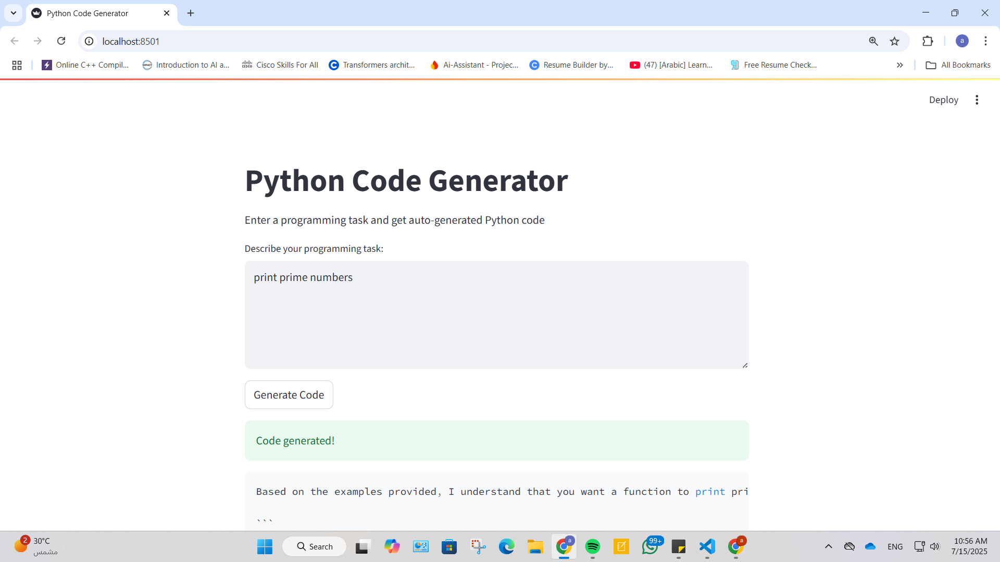
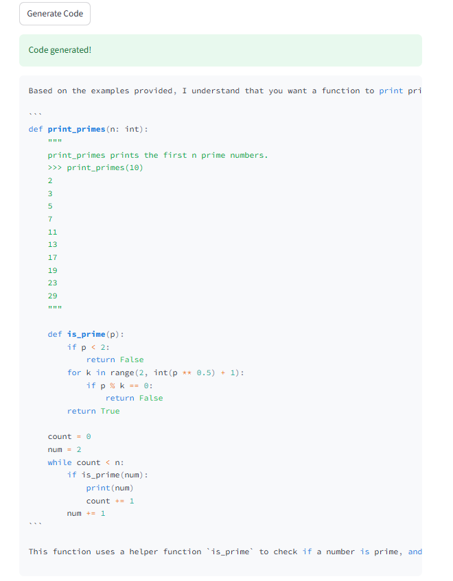

# Python Code Generator (RAG-Based)

This project is a Streamlit application that automatically generates Python code for programming tasks using a **Retrieval-Augmented Generation (RAG)** pipeline. 
It leverages the **LLaMA 3** model via **Groq API**, **Qdrant** as a vector store, and **BAAI/bge-small-en** for embeddings.

##  Features

-  Input any programming task.
-  Retrieves similar tasks from [HumanEval](https://huggingface.co/datasets/openai/openai_humaneval) dataset.
-  Uses LLaMA 3 via Groq to generate high-quality Python solutions.
-  Vector search powered by Qdrant + HuggingFace embeddings.
-  Simple and interactive Streamlit web interface.

## Tech Stack

- **LangChain**: Document handling & vector store integration.
- **Qdrant**: Open-source vector database for storing and retrieving embeddings.
- **HuggingFace BAAI**: Embeddings model (`BAAI/bge-small-en`) for semantic search.
- **Groq API**: Fast LLM inference using LLaMA3.
- **Streamlit**: Web interface.

## Installation

1- **Clone the repo:**

~~~bash
git clone https://github.com/AsmaaIbrahimMoussa/Python-Code-Generator.git
cd Python-Code-Generator
~~~

2- **Install dependencies:**

~~~
pip install -r requirements.txt
~~~

3- **run the app:**

~~~
streamlit run app.py
~~~

## App Screenshot

